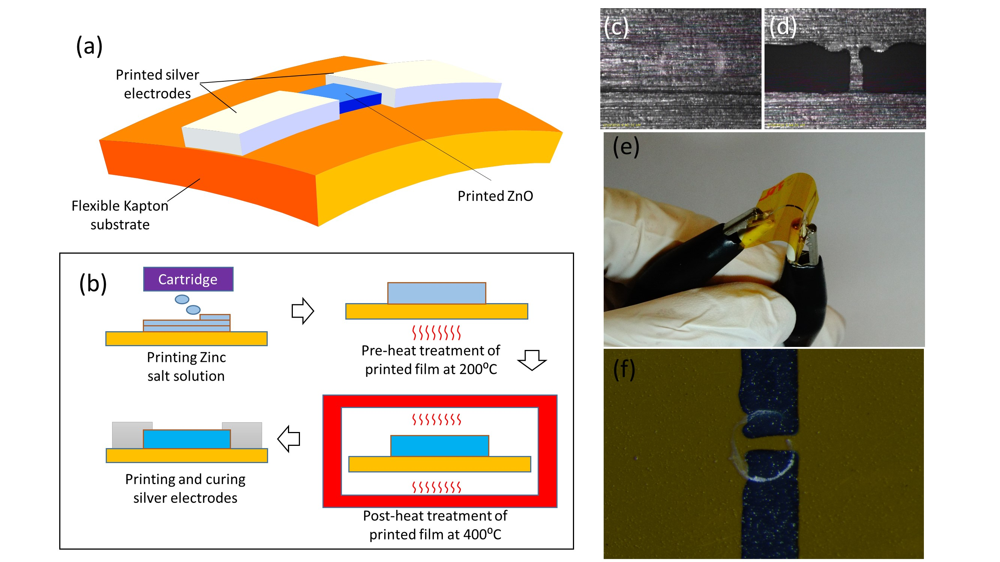

# All-Inkjet-Printed Flexible ZnO UV Photodetector

## Overview
This project demonstrates a fully inkjet-printed, micro-sized flexible ultraviolet (UV) photodetector based on zinc oxide (ZnO) thin films. Both the semiconductor layer and metallic electrodes are fabricated using inkjet printing, enabling a fully additive, maskless, and digitally controlled process compatible with flexible substrates. The device is designed for wearable UV monitoring and flexible optoelectronic applications.

## Problem & Motivation
- Conventional UV photodetectors rely on vacuum-based deposition and photolithography, which are costly and poorly suited for flexible substrates.
- Flexible and wearable UV sensors require low-temperature, scalable, and patternable fabrication methods.
- Fully printed inorganic semiconductor devices remain challenging due to film uniformity, crystallinity, and electrical performance constraints.

## Key Contributions
1. Demonstration of a **fully inkjet-printed ZnO UV photodetector**, including both ZnO semiconductor and silver electrodes.
2. Development of a **solution-based ZnO printing and thermal conversion process** compatible with flexible Kapton substrates.
3. Experimental validation of **fast photoresponse, high on/off ratio, and mechanical flexibility**.

---

## Device Structure and Fabrication

<figure>
  
  <figcaption>
    Device structure and fabrication process of the fully inkjet-printed ZnO UV photodetector.  
    (a) Schematic illustration of the device architecture on a flexible Kapton substrate with printed ZnO active layer and silver electrodes.  
    (b) Fabrication process flow including inkjet printing of zinc salt precursor, pre-heating, post-annealing, and printing of silver electrodes.  
    (c–f) Optical images showing printed electrodes, device channel definition, and device flexibility.
  </figcaption>
</figure>

---

## Film Morphology and Microstructure

<figure>
  
  <figcaption>
    Film morphology and microstructure of inkjet-printed ZnO thin films.  
    (a) Low-magnification SEM image of the printed ZnO region.  
    (b) High-magnification SEM image showing film uniformity.  
    (c,d) SEM images revealing interconnected micro-crack networks formed after thermal treatment, which enhance photoresponse performance.
  </figcaption>
</figure>

---

## Photoresponse Characteristics

<figure>
  
  <figcaption>
    Electrical and photoresponse characteristics of the printed ZnO UV photodetector.  
    (a) I–V characteristics measured in dark and under UV illumination.  
    (b) Time-resolved photoresponse under different UV intensities.  
    (c,d) Transient response fitting showing fast rise and decay dynamics.
  </figcaption>
</figure>

---

## Results Summary
- The printed ZnO photodetector exhibits Ohmic contact behavior and stable electrical characteristics.
- Devices demonstrate a high on/off current ratio under UV illumination and fast response times.
- Stable operation is maintained under repeated bending, confirming suitability for flexible and wearable electronics.

## Outputs
- **Journal paper:** *All-inkjet-printed flexible ZnO micro photodetector for a wearable UV monitoring device*, **Nanotechnology**, 2017.  
- **Status:** completed

## Reference
- Google Scholar profile:  
  https://scholar.google.com.sg/citations?user=RGOaklgAAAAJ

*Figures adapted from the author’s published work for academic presentation.*